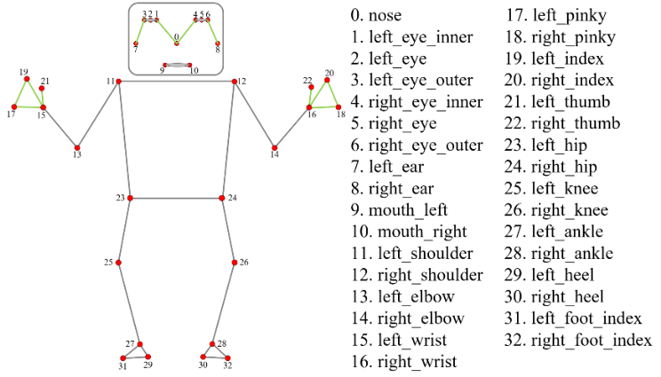
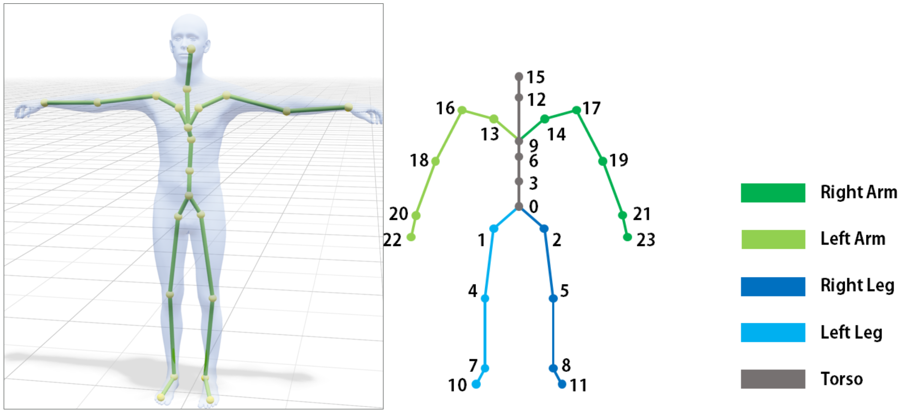
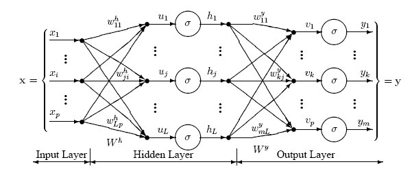
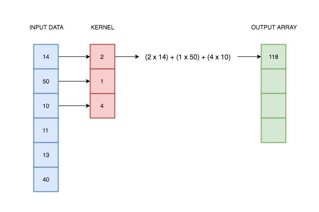
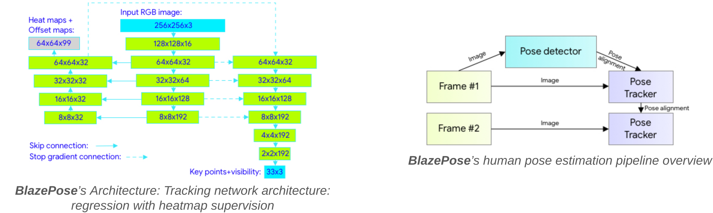
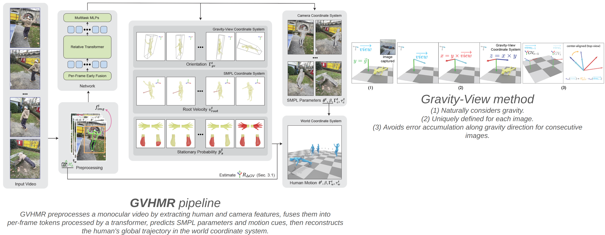

# Atelier GTAS - Reconnaissance de gestes de tennis

L'idée est de partir d'une **vidéo de tennis** et d'en classifier le geste joué. On récupère le mouvement de la personne dans la vidéo, puis on entraîne un petit réseau de neurones (PyTorch) qui apprend à reconnaître le geste.

Il y a deux notebooks. Ils font la même chose, seule la façon de récupérer le mouvement change :

- `GTAS_mediapipe.ipynb` - estimation avec **MediaPipe**.
- `GTAS_GVHMR.ipynb` - estimation avec **GVHMR**.

Accès aux Colab :

- MediaPipe : 
- GVHMR : 

Les gestes reconnus (multi-label : plusieurs peuvent être actifs en même temps) sont `forehand`, `backhand`, `service` (et `smash` dans la version MediaPipe).

> **C'est un atelier, il y a du code à compléter.** Le `MLPClassifier` est donné tout fait, mais le **`CNNClassifier` (CNN 1D), c'est à vous de l'écrire** - la cellule est un squelette avec des commentaires qui guident (encoding 1D → pooling masqué → MLP). Pareil pour les cellules « Classifions nos propres gestes » (capture webcam). Bref, il y a des cellules à trous.

## MediaPipe ou GVHMR ?

| | **MediaPipe** | **GVHMR** |
|---|---|---|
| Atout principal | Rapidité et simplicité | Qualité d'estimation (état de l'art) |
| Vitesse | Rapide, temps réel possible | Plus lent (installation lourde, inférences coûteuses) |
| Sortie | 33 points 3D (landmarks) | Paramètres SMPL (corps complet) |
| Représentation pour le classifieur | Positions + vitesses | Rotations 6D + translation |
| Usage en recherche | Pratique, léger | Paramètres SMPL largement utilisés en recherche |
| Création de dataset | Convient aux cas simples | Permet de construire son propre dataset à partir de vidéos in-the-wild, grâce à sa robustesse |

## Pipeline commun

**Vidéo -> mouvement (MediaPipe ou GVHMR) -> features -> classifieur (MLP ou CNN) -> gestes prédits.**

- Avec **MediaPipe** : le mouvement est une suite de 33 points 3D ; les features sont les positions recentrées/normalisées et leurs vitesses.
- Avec **GVHMR** : le mouvement est une suite de paramètres SMPL ; les features sont les rotations converties en représentation 6D (orientation globale + pose des articulations) plus la translation.

  
  &nbsp;&nbsp;
  

<em>Au dessus : les 33 landmarks de MediaPipe (BlazePose). En dessous : les 22 articulations du modèle SMPL utilisé par GVHMR.</em>

## Démarrage rapide

1. Ouvrir le notebook choisi dans **Google Colab**.
2. Activer un GPU via `Exécution > Modifier le type d'exécution > T4`.
3. Exécuter les cellules dans l'ordre, de haut en bas. Un sommaire cliquable est placé en haut de chaque notebook, et un lien de retour vers le sommaire est fourni à chaque section.

> Pour GVHMR, l'install (env conda + poids des modèles) est longue et lourde : ce sont les premières cellules qui s'en occupent, **n'y touchez pas**. Prévoyez une bonne connexion et un peu de patience (Le temps de prendre un café, ~10 min).

## Ce que font les notebooks, étape par étape

| Étape | Description |
|-------|-------------|
| Installation & imports | Installer l'estimateur (MediaPipe ou GVHMR) et charger les bibliothèques |
| 1. Test Video-to-Motion | Estimer le mouvement sur une vidéo d'exemple et afficher le rendu |
| 2.1 Dataset | Charger les séquences de mouvement et leurs labels. |
| 2.2 Features | Transformer chaque séquence en vecteurs par image (positions + vitesses pour MediaPipe, rotations 6D + translation pour GVHMR) |
| 3.1 / 3.2 Modèles + Entraînement | Choisir un **MLP** (résumé statistique de la séquence) ou un **CNN 1D** (motifs temporels du mouvement (À coder)). Puis entraîner le modèle avec validation, à l'aide d'une perte multi-label pondérée |
| 3.3 Résultats | Mesurer la précision par geste et tracer la matrice de confusion par combinaison de gestes |
| 3.4 Inférence | Prédire les gestes sur un fichier |
| 4. Tester ses propres gestes | Se filmer avec la webcam, puis faire prédire le geste |

## Les deux modèles

Deux classifieurs au choix, interchangeables :

- **MLP** - on résume la séquence par quelques stats (moyenne, écart-type, min, max) puis on classe. Simple et rapide, mais il ne voit pas l'ordre des frames.

  

- **CNN 1D** - des convolutions 1D glissent le long du temps pour repérer les motifs du mouvement, bien plus adaptées à une séquence de poses. **C'est lui que vous codez pendant l'atelier** (la cellule `CNNClassifier` est un squelette à remplir).

  

## Le dataset

Le dataset fourni est déjà passé par l'inférence, vous n'avez rien à ré-inférer. Les fichiers `.npz` contiennent directement les mouvements (paramètres SMPL pour GVHMR, landmarks pour MediaPipe) + un `.csv` d'annotations. On les charge et on entraîne.

Les notebooks le téléchargent automatiquement depuis Google Drive, mais voici les liens directs :

- Dataset MediaPipe (landmarks) : https://drive.google.com/file/d/14985toxIs_pWDkwZbV1rWXgQYW8olmzg/view?usp=sharing
- Dataset GVHMR (SMPL) : https://drive.google.com/file/d/1PUjJyJZ3q9_XfXvUNBYThF0URT05rpEG/view?usp=sharing

GVHMR est assez robuste pour qu'on puisse se constituer un dataset à partir de vidéos in-the-wild : on passe chaque vidéo dans GVHMR pour récupérer les paramètres SMPL, puis on annote. C'est comme ça que le dataset maison du notebook GVHMR a été créé - et c'est aussi ce que vous pouvez faire pour ajouter vos propres données.

La version MediaPipe, elle, s'appuie sur le dataset **THETIS** : des vidéos de gens jouant face caméra, dans un environnement contrôlé, sur lesquelles on a fait tourner MediaPipe.

## Démo avec une vidéo

Dans la dernière section de chaque notebook, deux options :
- Se filmer en direct à la webcam, puis lancer la prédiction.
- Charger un fichier existant et le tester (une vidéo, ou un fichier de mouvement déjà produit).

## Références

À titre indicatif, voici les pipelines d'inférence video-to-motion utilisées par chaque estimateur :

  

<em>Pipeline MediaPipe (estimation des 33 landmarks).</em>

  

<em>Pipeline GVHMR (récupération des paramètres SMPL).</em>

**MediaPipe**

- Lugaresi C., Tang J., Nash H., McClanahan C., Uboweja E., Hays M., Zhang F., Chang C.-L., Yong M., Lee J., Chang W.-T., Hua W., Georg M., & Grundmann M. (2019). **MediaPipe: A Framework for Perceiving and Processing Reality**. *Third Workshop on Computer Vision for AR/VR at IEEE Computer Vision and Pattern Recognition (CVPR) 2019*.

**GVHMR**

- Shen Z.\*, Pi H.\*, Xia Y., Cen Z., Peng S.†, Hu Z., Bao H., Hu R., & Zhou X. (2024). **World-Grounded Human Motion Recovery via Gravity-View Coordinates**. *SIGGRAPH Asia 2024*.

**SMPL (modèle de corps utilisé par GVHMR)**
- Loper, Matthew and Mahmood, Naureen and Romero, Javier and Pons-Moll, Gerard and Black, Michael J.**SMPL: A Skinned Multi-Person Linear Model**.
*SIGGRAPH Asia 2015*

**Représentation 6D des rotations (utilisée par GVHMR)**

- Zhou Y., Barnes C., Lu J., Yang, J., & Li H. (2019). **On the Continuity of Rotation Representations in Neural Networks**. *IEEE Conference on Computer Vision and Pattern Recognition (CVPR)*. arXiv:1812.07035 - https://arxiv.org/abs/1812.07035

**THETIS dataset (utilisé par la version MediaPipe)**

- Gourgari, S., Goudelis, G., Karpouzis, K., & Kollias, S. (2013). **Thetis: Three-dimensional tennis shots a human action dataset**. *Proceedings of the IEEE conference on computer vision and pattern recognition workshops* (pp. 676-681).
- Goudelis, G., Tsatiris, G., Karpouzis, K., & Kollias, S. (2017, August). **3D Cylindrical Trace Transform based feature extraction for effective human action classification**. *2017 IEEE Conference on Computational Intelligence and Games (CIG)* (pp. 96-103). IEEE.
- Varia, C., Tsatiris, G., Karpouzis, K., & Kollias, S. (2018, August). **A refined 3d dataset for the analysis of player actions in exertion games**. *2018 IEEE Conference on Computational Intelligence and Games (CIG)* (pp. 1-4). IEEE.

**Pipeline utilsée pour récolter le dataset issu de YouTube (utilisé par la version GVHMR)**

- SALAZAR, N., Dellandréa E., Lefort M., & Meyer A., (2026). **XmoPipe: A Pipeline for Large-Scale In-the-Wild Human Motion Dataset Construction**. *International Conference on Computer Animation, Social Agents, and Extended Reality CASAXR 26*.